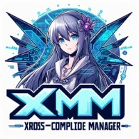
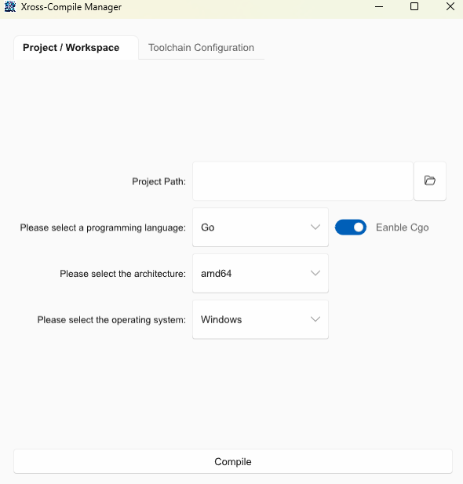

# XM - Xross Compile Manager

English| [简体中文](README.md)



XM (Xross-Compile Manager) is a cross-platform compilation management tool that supports cross-compilation for Go and Rust programming languages. Users can easily select the target compilation environment and architecture, and set compiler paths to simplify the cross-compilation process.

## Features

- Supports Go and Rust programming languages
- Supports Linux and Windows compilation environments
- Supports ARM and x86_64 architectures
- Allows users to set CC and CXX compiler paths
- Optional CGO support (Go language only)

## Installation
You can install XM from crates.io using Cargo:
```bash
cargo install xm
```
You can download the source code of XM from GitHub, then use the cargo tool to compile and install it:

```bash
git clone https://github.com/limitcool/xm.git
cd xm
cargo build --release
cargo install --path .
```

## Usage

1. After opening the software, you will see the following interface:

   

   - **Project Path**: Select your project path
   - **Programming Language**: Choose Go or Rust
   - **Compilation Environment**: Choose Linux or Windows
   - **Architecture**: Choose ARM or x86_64
   - **Enable CGO**: (Visible only when Go is selected) Choose whether to enable CGO

2. In the **Compiler Paths** tab, set the paths for CC and CXX compilers.

3. After configuring, click the “Compile” button to start the compilation.

## Contribution

If you want to contribute to this project, please follow these steps:

1. Fork this repository.
2. Create a new branch (`git checkout -b feature-branch`).
3. Commit your changes (`git commit -am 'Add new feature'`).
4. Push to the branch (`git push origin feature-branch`).
5. Create a new Pull Request.

## License

This project is licensed under the MIT License. For more details, please refer to the [LICENSE](LICENSE) file.
