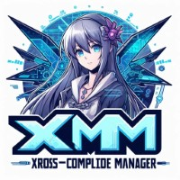

# XM - Xross Compile Manager

[English](README-en.md) | 简体中文



XM (Xross-Compile Manager) 是一个跨平台编译管理工具，支持 Go 和 Rust 编程语言的交叉编译。用户可以轻松选择目标编译环境和架构，并设置编译器路径，简化跨平台编译过程。

## 特性

- 支持 Go 和 Rust 编程语言
- 支持 Linux 和 Windows 编译环境
- 支持 ARM 和 x86_64 架构
- 允许用户设置 CC 和 CXX 编译器路径
- 可选择启用 CGO（仅 Go 语言）

## 安装
你可以使用Cargo从crates.io安装XM：
```bash
cargo install xm
```
您可以从 GitHub 下载 xm的源码，然后使用 cargo 工具进行编译和安装：

```bash
git clone https://github.com/limitcool/xm.git
cd xm
cargo build --release
cargo install --path .
```

## 使用

1. 打开软件后，您将看到以下界面：

   

   - **项目路径**: 选择您的项目路径
   - **编程语言**: 选择 Go 或 Rust
   - **编译环境**: 选择 Linux 或 Windows
   - **架构**: 选择 ARM 或 x86_64
   - **启用 CGO**: （仅在选择 Go 时可见）选择是否启用 CGO

2. 在 **编译器路径** 标签页中，设置 CC 和 CXX 编译器的路径。

3. 配置完成后，点击 “Compile” 按钮开始编译。


## 贡献

如果您想为此项目做出贡献，请按照以下步骤：

1. Fork 此仓库。
2. 创建一个新的分支（`git checkout -b feature-branch`）。
3. 提交您的更改（`git commit -am 'Add new feature'`）。
4. 推送到分支（`git push origin feature-branch`）。
5. 创建一个新的 Pull Request。

## 许可

该项目使用 MIT 许可。详情请参阅 [LICENSE](LICENSE) 文件。
